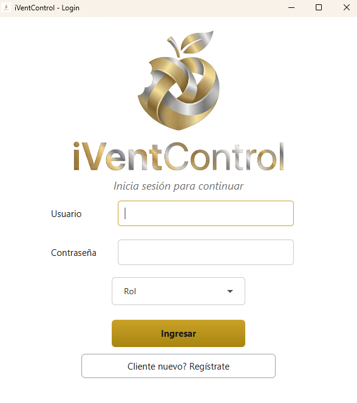
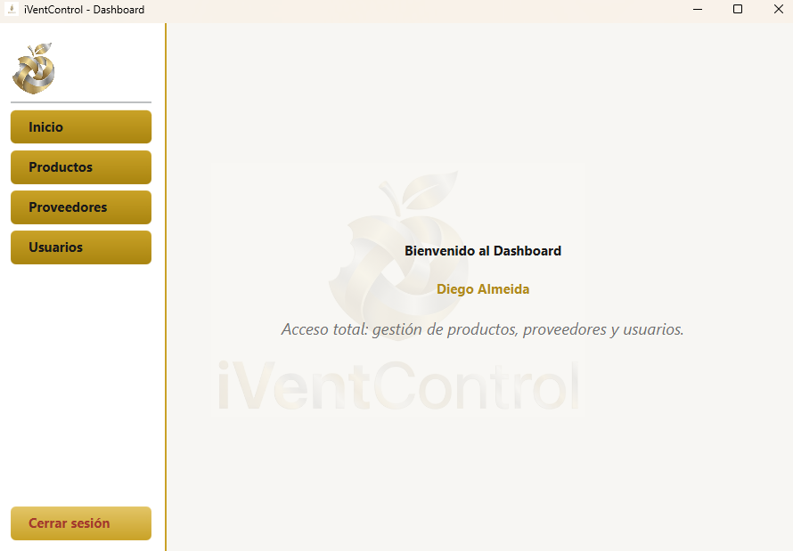
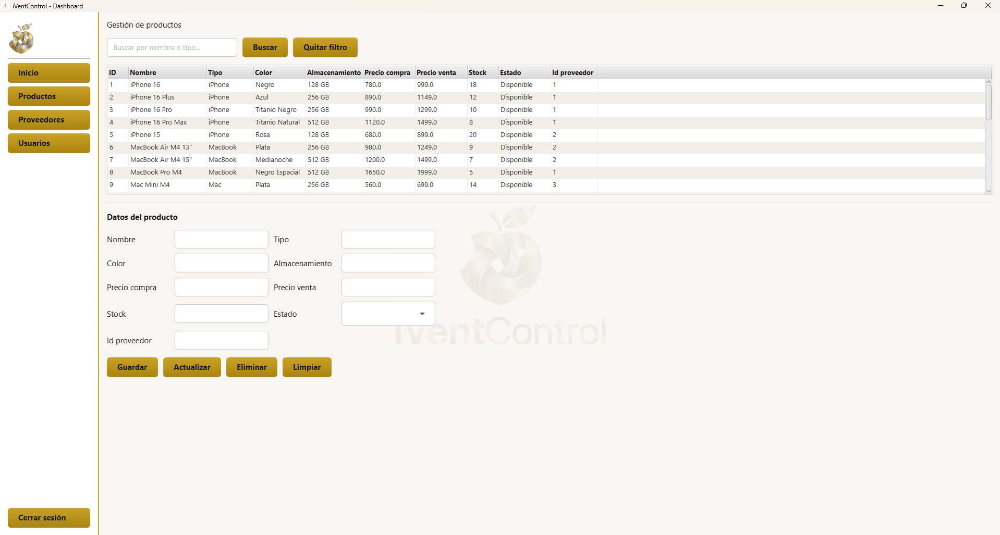
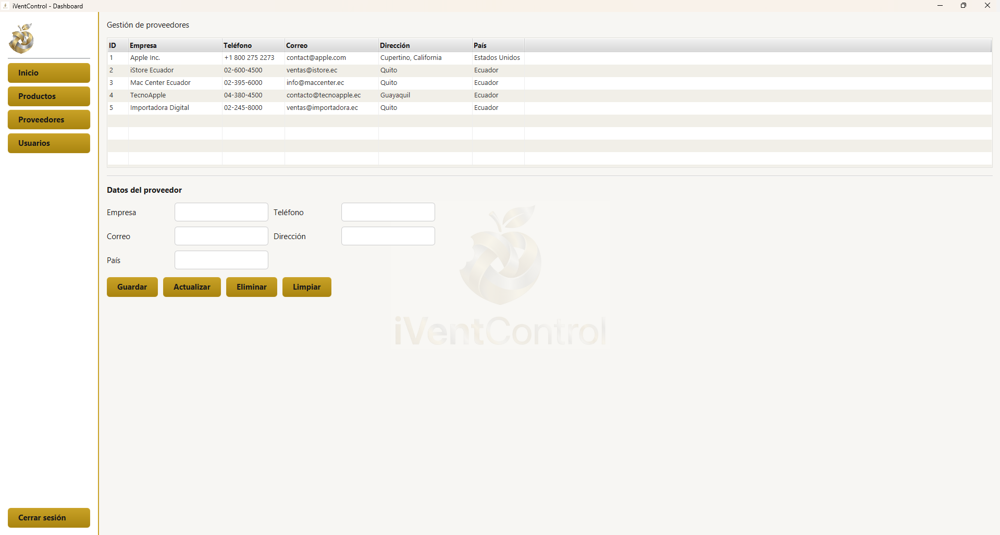

# iVentControl

### Proyecto final programación orientada a objetos

---

## Autores:

- Diego Almeida
- Jordy Cajas

---
## Descripción del proyecto

iVentControl es un sistema de control de inventario hecho para tiendas de venta de,
ya sean dispositivos de apple o componentes del mismo. Fue diseñado para facilitar la administración de productos,
usuarios y existencias.

La aplicación fue desarrollada aplicando los principios de la programación orientada a objetos, como:
- Abstracción
- Encapsulamiento
- Herencia
- Polimorfismo
- Separación de responsabilidades

El sistema cuenta con una interfaz gráfica desarrollada con JavaFX y utiliza una base de datos PostgreSQL
para almacenar la información.

---

## Herramientas Usadas

- Java 26: lenguaje principal
- JavaFX: librería para la creación de la interfaz gráfica
- FXML: definición de pantallas y componentes visuales
- Scene Builder: diseño visual de los archivos FXML
- Maven: administrador de dependencias y compilador del proyecto
- PostgreSQL: gestor de base de datos
- Supabase: alojamiento de la base de datos PostgreSQL
- JDBC: conexión entre la aplicación Java y la base de datos
- IntelliJ IDEA: entorno de desarrollo
- Git y GitHub: control de versiones y trabajo colaborativo
- Launch4j: generador del archivo ejecutable para windows

---

## Instalación

1. Clonar el repositorio
2. Abrir el proyecto ya sea con el ejecutable que se encuentra en dist, con el archivo jar o directamente con el IDE de preferencia
3. Ejecutar el proyecto y usar

---

## Capturas

### Inicio de sesión

### Menu principal

### Gestión de usuarios

### Gestión de productos

### Gestión de proveedores

---